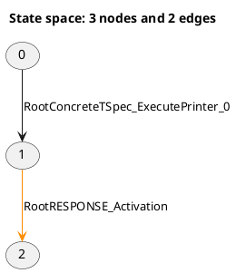

# LTSVisualizer

An interactive application for exploring large labelled transition systems and reachability graphs stored in PlantUML or JSON format.


LTSVisualizer was created primarily for reachability graphs generated from Colored Petri Nets, where:

- **Nodes** represent markings or states.
- **Edges** represent fired transitions.
- **Transition inputs** describe the data consumed by a transition.
- **State markings** describe the distribution of tokens across Petri-net places.

The application uses a React and Cytoscape.js frontend for visualization. An optional Python and FastAPI backend parses PlantUML graph files.

JSON graphs are parsed directly in the browser and do not require the backend.

LTSVisualizer supports small linear graphs and large cyclic state spaces containing thousands of states and transitions.

## Features

### Graph input

- Open `.json` LTS graph files directly in the browser.
- Open `.puml`, `.plantuml`, and compatible PlantUML `.txt` files through the FastAPI backend.
- Validate JSON graph structure, node IDs, edge IDs, references, and saved paths.
- Preserve transition colors such as `#darkorange`.
- Preserve structured transition-input data.
- Preserve structured state markings and token values.
- Preserve raw transition inputs and raw state markings when available.
- Export the complete loaded graph as JSON for later frontend-only use.

### Graph exploration

- Explore one-, two-, or three-hop neighborhoods around a selected state.
- Search directly for a state by ID.
- Display the complete graph using **Show all**.
- Switch between hierarchical and grid layouts.
- Show or hide transition labels.
- Pan, zoom, select, and manually reposition states.
- Use a lightweight full-graph overview for large state spaces.

### Inspection

- Inspect state markings by hovering over or selecting states.
- Inspect consumed transition-input data by hovering over or selecting transitions.
- Pin inspector content while continuing to explore the graph.
- Clear pinned inspector content without clearing a selected path.

### Manual path selection

- Start a path from the currently focused state.
- Extend a path by selecting a highlighted successor state.
- Select an exact transition using the **Choose next transition** controls.
- Distinguish parallel transitions using unique edge IDs.
- Support loops and repeated state occurrences.
- Undo the most recent transition.
- Restart or clear the selected path.
- Keep transition labels visible while constructing a path.
- Preserve graph zoom, pan, and manually adjusted state positions.

### Path export

- Export a selected path as PlantUML.
- Export a selected path as JSON.
- Preserve exact transition order.
- Preserve loops and repeated transition traversals.
- Preserve parallel-edge identity.
- Preserve state markings, transition inputs, labels, and colors.
- Reopen exported PlantUML paths.
- Reopen exported JSON as a regular graph.

### Deployment

- Run JSON workflows entirely in the browser.
- Run in development mode with Vite and the optional FastAPI backend.
- Run in combined production mode from one local server.
- Download a portable Windows binary without installing a development environment.

## Download for Windows

Download the latest portable Windows version from:

<https://github.com/dbera/LTSVisualizer/releases/latest>

Python, Node.js, npm, and a development environment are not required.

### Installation

1. Download `LTSVisualizer-Windows-x64.zip` from the official GitHub Release.
2. Open PowerShell in the directory containing the downloaded ZIP.
3. Remove the Windows internet-download restriction:

   ```powershell
   Unblock-File .\LTSVisualizer-Windows-x64.zip
   ```

4. Extract the complete ZIP file.
5. Open the extracted directory.
6. Run:

   ```text
   LTSVisualizer.exe
   ```

7. Keep the `_internal` directory beside `LTSVisualizer.exe`. The application will not run correctly without it.

LTSVisualizer starts a local server and opens the dashboard automatically in the default browser.

### Verify the download

The GitHub Release includes a file named `SHA256SUMS.txt`.

Calculate the SHA-256 checksum of the downloaded ZIP:

```powershell
Get-FileHash .\LTSVisualizer-Windows-x64.zip -Algorithm SHA256
```

Compare the displayed hash with the value in `SHA256SUMS.txt`. The two values must match.

Only run binaries downloaded from the official LTSVisualizer Releases page.

### Windows SmartScreen notice

LTSVisualizer is currently distributed as an unsigned Windows application. Microsoft Defender SmartScreen may display a **Windows protected your PC** warning.

If the ZIP was downloaded from the official GitHub Release and the SHA-256 checksum matches:

1. Select **More info** in the SmartScreen window.
2. Confirm that the application name is `LTSVisualizer.exe`.
3. Select **Run anyway**, if permitted by the Windows security policy.

Some managed or corporate Windows systems may prevent unsigned applications from running. In that case, contact the system administrator.

### Optional graphical unblock method

Depending on the Windows configuration, the downloaded ZIP may provide an **Unblock** option:

1. Right-click `LTSVisualizer-Windows-x64.zip`.
2. Select **Properties**.
3. On the **General** tab, select **Unblock**, if available.
4. Select **Apply**.
5. Extract the ZIP after unblocking it.

If the **Unblock** option is not shown or does not work, use:

```powershell
Unblock-File .\LTSVisualizer-Windows-x64.zip
```

## Supported input formats

Select **Open LTS Graph File** to open a graph.

The file picker accepts:

```text
.json
.puml
.plantuml
.txt
```

### JSON input

JSON graphs are parsed and validated directly in the browser.

The FastAPI backend is not required for:

- Opening JSON graphs
- Exploring graphs
- Inspecting markings and transition inputs
- Selecting paths
- Exporting the complete graph as JSON
- Exporting selected paths as JSON
- Exporting selected paths as PlantUML

### PlantUML input

PlantUML graph files are sent to the FastAPI backend for parsing.

If the backend is unavailable, JSON workflows continue to work. PlantUML import displays an error explaining that FastAPI must be started.

## PlantUML input example

LTSVisualizer accepts PlantUML graph edges in the following form:



The semantic comments are optional. A file containing only states, edges, and transition labels can still be visualized.

## JSON input format

LTSVisualizer JSON documents use explicit nodes and edges.

A complete graph document has this structure:

```json
{
  "format": "ltsvisualizer",
  "version": 1,
  "type": "graph",
  "metadata": {
    "title": "Example reachability graph"
  },
  "nodes": [
    {
      "id": "0",
      "marking_raw": null,
      "marking": {
        "input": [
          {
            "id": 42
          }
        ]
      }
    },
    {
      "id": "1",
      "marking_raw": null,
      "marking": {
        "processing": [
          {
            "id": 42
          }
        ]
      }
    }
  ],
  "edges": [
    {
      "id": "edge-17",
      "source": "0",
      "target": "1",
      "transition": "StartProcessing",
      "color": "darkorange",
      "inputs_raw": null,
      "inputs": {
        "request": {
          "id": 42
        }
      }
    }
  ]
}
```

### Node fields

Each node contains:

- `id`: Unique state identifier.
- `marking`: Optional structured state marking.
- `marking_raw`: Optional original marking text.

Example:

```json
{
  "id": "42",
  "marking_raw": null,
  "marking": {
    "requests": [
      {
        "id": 100
      }
    ]
  }
}
```

### Edge fields

Each edge contains:

- `id`: Unique edge identifier.
- `source`: Source node ID.
- `target`: Target node ID.
- `transition`: Transition name.
- `color`: Optional transition color.
- `inputs`: Optional structured transition-input data.
- `inputs_raw`: Optional original transition-input text.

Example:

```json
{
  "id": "edge-42",
  "source": "10",
  "target": "11",
  "transition": "ProcessRequest",
  "color": null,
  "inputs_raw": null,
  "inputs": {
    "request": {
      "id": 100
    }
  }
}
```

The edge ID identifies the exact edge. Connectivity is represented separately by `source` and `target`.

This allows LTSVisualizer to distinguish parallel edges, including multiple transitions with identical source, target, and transition names.

### Lightweight graph documents

The format envelope is optional for imported JSON.

This is also accepted:

```json
{
  "nodes": [
    {
      "id": "0"
    },
    {
      "id": "1"
    }
  ],
  "edges": [
    {
      "id": "edge-1",
      "source": "0",
      "target": "1",
      "transition": "Continue"
    }
  ]
}
```

Omitted optional semantic fields are normalized to `null`.

## Selected-path JSON format

A selected-path JSON export contains a self-contained graph subset and an ordered path:

```json
{
  "format": "ltsvisualizer",
  "version": 1,
  "type": "selected-path",
  "metadata": {
    "title": "Selected path 0 to 3",
    "startStateId": "0",
    "endStateId": "3",
    "stateCount": 4,
    "transitionCount": 3
  },
  "nodes": [
    {
      "id": "0",
      "marking_raw": null,
      "marking": null
    },
    {
      "id": "1",
      "marking_raw": null,
      "marking": null
    }
  ],
  "edges": [
    {
      "id": "edge-1",
      "source": "0",
      "target": "1",
      "transition": "Start",
      "color": null,
      "inputs_raw": null,
      "inputs": null
    }
  ],
  "path": {
    "startNodeId": "0",
    "edgeIds": [
      "edge-1"
    ]
  }
}
```

The `nodes` and `edges` arrays describe the graph subset.

The ordered `path.edgeIds` array describes the exact traversal. It preserves:

- Transition order
- Parallel-edge identity
- Repeated transitions
- Loops
- Repeated state occurrences

## Unique graph elements and traversal occurrences

A path may visit the same state or traverse the same edge multiple times.

For example:

```text
0 -> 1 -> 0 -> 1
```

This traversal contains:

```text
4 state occurrences
3 transition steps
```

However, the graph may contain only:

```text
2 unique states
2 unique edges
```

Selected-path JSON stores each node and edge once in the graph arrays. Repeated traversal steps are preserved in `path.edgeIds`.

When an exported selected-path JSON file is reopened, LTSVisualizer loads the contained nodes and edges as a regular graph. Search, neighborhood, layout, labels, and **Show all** remain available.

## Using the dashboard

### Open a graph

1. Open the dashboard.
2. Select **Open LTS Graph File**.
3. Choose a supported PlantUML or JSON file.
4. Wait for the graph to load.

### Explore a graph

1. Enter a state ID to focus on a particular state.
2. Use **1 hop**, **2 hops**, or **3 hops** to control neighborhood depth.
3. Use **Show all** to display the complete graph.
4. Switch between **Hierarchical** and **Grid** layouts.
5. Toggle transition labels for readability and performance.
6. Hover over graph elements to inspect semantic data.
7. Select a state or transition to pin its data in the inspector.
8. Drag states to adjust their positions.
9. Drag the background to pan.
10. Use the mouse wheel to zoom.

For very large graphs, neighborhood exploration is recommended instead of displaying every node and transition simultaneously.

## Manual path selection

### Start a path

1. Search for or focus the desired starting state.
2. Select **Select path**.
3. The focused state becomes the start of the path.

Path colors are:

```text
Green   Path start
Blue    Selected path
Orange  Current endpoint
Cyan    Available next states and transitions
```

### Extend a path

Use either of these methods:

- Select a cyan successor state when the connecting transition is unambiguous.
- Select an exact transition using **Choose next transition**.

The transition controls are recommended when:

- Multiple transitions lead to the same state.
- Parallel transitions have identical names.
- A graph edge is difficult to select directly.

Each transition is selected by its unique edge ID.

### Loops and repeated states

Paths may revisit earlier states and traverse edges repeatedly.

Selecting a transition back to an earlier state creates a loop. It does not rewind the path.

### Undo and clear

- **Undo** removes the most recently selected transition.
- **Restart path** discards the current path and starts a new selection.
- **Clear path** exits path-selection mode.
- The Inspector's clear action only unpins inspected data and does not clear the selected path.

## Export a selected path

The Path controls provide:

```text
Export .puml
Export .json
```

### PlantUML path export

PlantUML export creates a graph that can be reopened in LTSVisualizer.

The export preserves:

- Selected states
- Selected transitions
- Transition order
- Transition labels
- Transition colors
- State markings
- Transition inputs

### JSON path export

JSON export creates a self-contained selected-path document.

The export preserves:

- Unique graph nodes and edges
- Exact ordered edge IDs
- Loops and repeated traversals
- Parallel-edge identity
- State markings
- Transition inputs
- Raw semantic values
- Transition colors

Exported JSON files can be reopened without running the backend.

## Export the complete graph as JSON

Select **Export graph JSON** to export every state and transition in the currently loaded graph.

The export uses the complete loaded graph, regardless of:

- The currently visible neighborhood
- The selected state
- Whether **Show all** is active
- The currently selected path

The generated JSON preserves:

- All unique states
- All unique transitions
- Parallel edges
- State markings and raw markings
- Transition inputs and raw inputs
- Transition labels
- Transition colors
- Graph state and transition counts

The filename is derived from the opened source file and made safe for downloading.

Examples:

```text
example.puml       -> example.json
my graph.puml      -> my-graph.json
rg.plantuml.txt    -> rg.plantuml.json
```

This enables a backend-independent workflow:

```text
PlantUML file
  -> FastAPI parsing
  -> Export graph JSON
  -> Reopen JSON later without FastAPI
```

A complete graph JSON export has document type `graph` and includes graph counts in its metadata:

```json
{
  "format": "ltsvisualizer",
  "version": 1,
  "type": "graph",
  "metadata": {
    "title": "Example graph",
    "stateCount": 1000,
    "transitionCount": 2500
  },
  "nodes": [],
  "edges": []
}
```

The exported document contains the graph stored in memory, not only the nodes and transitions currently rendered by Cytoscape.js. A one-hop neighborhood can therefore be visible while **Export graph JSON** still exports the complete loaded graph.

## Architecture

LTSVisualizer supports frontend-only JSON workflows and combined PlantUML workflows.

### JSON workflow

```text
JSON graph file
  |
  v
React frontend
  |
  |-- JSON parsing and validation
  |-- Cytoscape.js visualization
  |-- Manual path selection
  |-- Complete graph JSON export
  |-- Selected-path JSON export
  `-- Selected-path PlantUML export
```

The JSON workflow runs completely in the browser.

### PlantUML development workflow

```text
Browser
  |
  v
Vite development server :5173
  |
  |  proxies /graph requests
  v
FastAPI development server :8000
  |
  `-- PlantUML parsing
```

Vite provides hot module replacement for frontend development. Requests beginning with `/graph` are forwarded to FastAPI by `frontend/vite.config.ts`.

### Combined production and packaged mode

```text
Browser
  |
  v
FastAPI and Uvicorn :8765
  |-- React production files
  |-- GET  /api/health
  |-- GET  /graph
  `-- POST /graph/upload
```

The React production build is generated in `frontend/dist` and served by FastAPI.

`backend/launcher.py` selects an available local port, starts Uvicorn, and opens the dashboard in the default browser.

## Technology stack

### Backend

- Python 3.11 or newer
- FastAPI
- Uvicorn
- Pydantic
- python-multipart
- pytest
- HTTPX
- PyInstaller

### Frontend

- React
- TypeScript
- Vite
- Cytoscape.js
- Axios
- Vitest

### Automation

- GitHub Actions for continuous integration
- GitHub Actions for Windows binary builds
- GitHub Releases for downloadable ZIP packages and checksums

## Project structure

```text
LTSVisualizer/
├── .github/
│   ├── ISSUE_TEMPLATE/
│   ├── pull_request_template.md
│   └── workflows/
│       ├── ci.yml
│       └── release.yml
├── backend/
│   ├── app/
│   │   ├── models/
│   │   │   └── graph_model.py
│   │   ├── parser/
│   │   │   ├── puml_parser.py
│   │   │   └── token_parser.py
│   │   └── main.py
│   ├── tests/
│   │   ├── test_api.py
│   │   ├── test_puml_parser.py
│   │   └── test_token_parser.py
│   ├── launcher.py
│   ├── requirements.txt
│   └── requirements-dev.txt
├── frontend/
│   ├── public/
│   ├── src/
│   │   ├── components/
│   │   │   ├── JsonViewer.css
│   │   │   ├── JsonViewer.tsx
│   │   │   ├── PathSelectionControls.css
│   │   │   └── PathSelectionControls.tsx
│   │   ├── graph/
│   │   │   ├── graphJson.test.ts
│   │   │   ├── graphJson.ts
│   │   │   ├── pathExport.test.ts
│   │   │   ├── pathExport.ts
│   │   │   ├── pathSelection.test.ts
│   │   │   └── pathSelection.ts
│   │   ├── App.css
│   │   ├── App.tsx
│   │   ├── index.css
│   │   └── main.tsx
│   ├── package.json
│   ├── package-lock.json
│   └── vite.config.ts
├── sample-data/
├── LTSVisualizer.spec
├── .editorconfig
├── .gitattributes
├── .gitignore
├── CHANGELOG.md
├── CODE_OF_CONDUCT.md
├── CONTRIBUTING.md
├── LICENSE
├── README.md
└── SECURITY.md
```

The following directories are generated locally and intentionally ignored by Git:

```text
build/
dist/
release/
frontend/dist/
```

## Developer prerequisites

Install the following software before running or building the project locally:

- Python 3.11 or newer
- Node.js 22 LTS or newer
- npm
- Git

The backend is optional for frontend-only JSON development.

Windows is required to build the Windows executable locally. GitHub Actions uses a Windows runner to produce official Windows release packages.

## Clone the repository

```bash
git clone https://github.com/dbera/LTSVisualizer.git
cd LTSVisualizer
```

## Set up the frontend

```bash
cd frontend
npm install
cd ..
```

For deterministic continuous-integration or release builds, use `npm ci` when `node_modules` is absent and `package-lock.json` is current.

## Set up the backend

The backend is required for PlantUML input, combined production mode, and Windows packaging.

### Windows PowerShell

```powershell
python -m venv .venv
.\.venv\Scripts\Activate.ps1
python -m pip install --upgrade pip
python -m pip install -r backend\requirements-dev.txt
```

### Linux or macOS

```bash
python3 -m venv .venv
source .venv/bin/activate
python -m pip install --upgrade pip
python -m pip install -r backend/requirements-dev.txt
```

## Run in development mode

### Frontend-only JSON development

From the repository root:

```powershell
cd frontend
npm run dev
```

Open the URL displayed by Vite, normally:

```text
http://localhost:5173
```

JSON input, exploration, inspection, path selection, complete-graph JSON export, and selected-path export work without starting FastAPI.

PlantUML files cannot be opened while the backend is unavailable.

### PlantUML development mode

PlantUML development uses separate backend and frontend servers.

#### Terminal 1: FastAPI backend

From the repository root:

```powershell
cd backend
uvicorn app.main:app --reload --port 8000
```

Backend API documentation is available at:

```text
http://127.0.0.1:8000/docs
```

The health endpoint is available at:

```text
http://127.0.0.1:8000/api/health
```

#### Terminal 2: Vite frontend

From the repository root:

```powershell
cd frontend
npm run dev
```

Open the URL displayed by Vite, normally:

```text
http://localhost:5173
```

During development, Vite proxies `/graph` requests to FastAPI on port `8000`.

## Run in combined production mode

Combined production mode serves both the built React frontend and the PlantUML API from FastAPI.

### 1. Build the frontend

From the repository root:

```powershell
cd frontend
npm run build
cd ..
```

Verify the build:

```powershell
Test-Path frontend\dist\index.html
```

Expected output:

```text
True
```

### 2. Start the combined application

```powershell
cd backend
python launcher.py
```

The launcher normally opens:

```text
http://127.0.0.1:8765
```

If port `8765` is occupied, the launcher selects another available local port.

Vite is not required in combined production mode.

## API endpoints

### Health endpoint

```http
GET /api/health
```

Example response:

```json
{
  "status": "ok",
  "application": "LTSVisualizer"
}
```

### Parse the bundled development example

```http
GET /graph
```

### Upload and parse a PlantUML graph

```http
POST /graph/upload
```

The upload endpoint accepts multipart form data with a field named `file`.

JSON files are not sent to this endpoint. JSON parsing is performed by the frontend.

## Development checks

### Backend tests

From the repository root in PowerShell:

```powershell
$env:PYTHONPATH = "backend"
python -m pytest backend\tests -v
```

### Frontend tests

```powershell
cd frontend
npm test
```

### Frontend lint and build

```powershell
cd frontend
npm run lint
npm run build
cd ..
```

### Full local verification

Before packaging or releasing:

1. Run all backend tests.
2. Run all frontend tests.
3. Run frontend linting.
4. Run the frontend production build.
5. Start `backend/launcher.py`.
6. Confirm the dashboard and `/api/health` load.
7. Open a small PlantUML graph.
8. Open a large PlantUML graph.
9. Open a JSON graph with the backend stopped.
10. Test search, neighborhoods, layouts, labels, dragging, and inspector data.
11. Test manual path selection.
12. Export and reopen a selected path as PlantUML.
13. Export and reopen a selected path as JSON.
14. Focus a small neighborhood and export the complete loaded graph as JSON.
15. Stop the backend and reopen the complete graph JSON.
16. Confirm that states outside the previously visible neighborhood are available.
17. Confirm that markings, transition inputs, colors, and parallel edges are preserved.
18. Confirm there are no browser-console errors.

## Build the Windows application locally

Windows is required for a local Windows build.

### 1. Build the frontend

```powershell
cd frontend
npm run build
cd ..
```

### 2. Install development and packaging dependencies

```powershell
python -m pip install --upgrade -r backend\requirements-dev.txt
```

### 3. Run tests

```powershell
$env:PYTHONPATH = "backend"
python -m pytest backend\tests -v

cd frontend
npm test
npm run lint
npm run build
cd ..
```

### 4. Build with PyInstaller

```powershell
python -m PyInstaller --clean --noconfirm LTSVisualizer.spec
```

The generated application is written to:

```text
dist/
└── LTSVisualizer/
    ├── LTSVisualizer.exe
    └── _internal/
```

Run the local build with:

```powershell
.\dist\LTSVisualizer\LTSVisualizer.exe
```

Always test the complete `dist/LTSVisualizer` directory outside the repository before publishing it.

Do not distribute only the EXE because `_internal` is required.

## Create a local Windows release ZIP

From the repository root:

```powershell
New-Item -ItemType Directory -Force release

Compress-Archive `
  -Path dist\LTSVisualizer\* `
  -DestinationPath release\LTSVisualizer-Windows-x64.zip `
  -Force
```

Generate a SHA-256 checksum:

```powershell
$hash = Get-FileHash `
  release\LTSVisualizer-Windows-x64.zip `
  -Algorithm SHA256

"$($hash.Hash)  LTSVisualizer-Windows-x64.zip" |
  Set-Content release\SHA256SUMS.txt
```

The release directory then contains:

```text
release/
├── LTSVisualizer-Windows-x64.zip
└── SHA256SUMS.txt
```

## GitHub Actions

### Continuous integration

`.github/workflows/ci.yml` runs for pushes and pull requests targeting `main`.

The workflow:

- Installs backend dependencies.
- Compiles and imports the backend.
- Runs backend tests.
- Installs frontend dependencies.
- Runs frontend tests.
- Runs frontend linting.
- Builds the frontend.

### Windows release build

`.github/workflows/release.yml` runs:

- Manually through **Actions → Build Windows release → Run workflow**.
- Automatically when a tag matching `v*` is pushed.

A manual run creates two temporary workflow artifacts:

- `LTSVisualizer-Windows-x64`, which can be extracted and run directly.
- `LTSVisualizer-release-files`, which contains the release ZIP and checksum.

A tag-triggered run also publishes a GitHub Release containing:

```text
LTSVisualizer-Windows-x64.zip
SHA256SUMS.txt
```

## Publish a release

### 1. Prepare the release

- Update `CHANGELOG.md`.
- Update `README.md` when user-facing behavior changes.
- Run all backend and frontend checks.
- Verify the local or manual GitHub Actions build.
- Commit and push all release changes to `main`.
- Wait for continuous integration to pass.

### 2. Synchronize the local branch

```powershell
git switch main
git pull origin main
git status
```

The working tree must be clean.

### 3. Create and push an annotated tag

Replace the version number as appropriate:

```powershell
git tag -a v0.3.0 -m "LTSVisualizer 0.3.0"
git push origin v0.3.0
```

Pushing the tag triggers the Windows release workflow.

When the workflow succeeds, the release is published at:

<https://github.com/dbera/LTSVisualizer/releases>

## Current limitations

- The PlantUML parser targets the reachability-graph convention described above rather than every PlantUML diagram type.
- PlantUML input requires the FastAPI backend.
- JSON input works without the backend.
- Extremely large full-graph views can be visually dense even when rendering remains responsive.
- Global force-directed layouts are intentionally avoided for large state spaces because they can be computationally expensive in the browser.
- Uploaded PlantUML files are parsed in memory and are not intended to be permanently stored by the backend.
- The Windows executable is unsigned and may trigger Microsoft Defender SmartScreen.
- The current automated binary release targets Windows x64 only.

## Roadmap

Planned development priorities:

1. Refactor graph loading, shared graph types, Cytoscape integration, and visualization logic.
2. Experiment with constrained graph search.

The constrained graph-search experiment may support:

- Start and optional target states
- Required transitions in order
- Forbidden transitions
- Maximum path length
- Shortest matching paths
- Loops and parallel transitions
- Reuse of the existing path visualization and export functionality

Additional potential improvements include:

- Deadlock-state detection
- Strongly connected component analysis
- State-to-state marking differences
- Token-journey visualization
- Transition-frequency analytics
- Authenticode signing for Windows releases
- Additional operating-system packages

## Contributing

Contributions, bug reports, and feature suggestions are welcome.

See [`CONTRIBUTING.md`](CONTRIBUTING.md) for development and pull-request guidelines.

## Security

Please do not disclose security vulnerabilities through public GitHub issues.

See [`SECURITY.md`](SECURITY.md) for the reporting process.

## License

This project is licensed under the MIT License.

See [`LICENSE`](LICENSE) for details.

## Author

Debjyoti Bera

Project repository: <https://github.com/dbera/LTSVisualizer>
