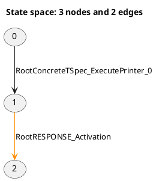

# LTSVisualizer

An interactive web application for exploring large labelled transition systems and reachability graphs described in PlantUML format.


LTSVisualizer was created primarily for reachability graphs generated from Colored Petri Nets, where:

- **Nodes** represent markings or states.
- **Edges** represent fired transitions.
- **Transition input comments** describe the data consumed by a transition.
- **Marking comments** describe the distribution of tokens across Petri-net places.

The application combines a Python and FastAPI parser with a React and Cytoscape.js frontend. It supports both small linear graphs and large cyclic state spaces containing thousands of nodes and transitions.

## Features

- Open `.puml`, `.plantuml`, and compatible PlantUML `.txt` files from the browser.
- Parse directed states and transitions from PlantUML graph syntax.
- Preserve transition colors such as `#darkorange`.
- Parse structured transition-input data.
- Parse structured state markings and token values.
- Explore one-, two-, or three-hop neighborhoods around a selected state.
- Search directly for a state by ID.
- Switch between hierarchical and grid layouts.
- Show or hide transition labels.
- Pan, zoom, select, and manually reposition states.
- Inspect state markings by hovering over or selecting nodes.
- Inspect consumed transition-input data by hovering over or selecting edges.
- Pin inspector content while continuing to explore the graph.
- Use a lightweight full-graph overview for very large state spaces.
- Run in development mode with Vite and FastAPI.
- Run in combined production mode from one local server.
- Download a portable Windows binary without installing a development environment.

## Download for Windows

Download the latest portable Windows version from:

<https://github.com/dbera/LTSVisualizer/releases/latest>

Python, Node.js, npm, and a development environment are not required.

### Installation

1. Download `LTSVisualizer-Windows-x64.zip` from the official GitHub Release.

2. Open PowerShell in the directory containing the downloaded ZIP.

3. Remove the Windows internet-download restriction:

   ```powershell
   Unblock-File .\LTSVisualizer-Windows-x64.zip
   ```

4. Extract the complete ZIP file.

5. Open the extracted directory.

6. Run:

   ```text
   LTSVisualizer.exe
   ```

7. Keep the `_internal` directory beside `LTSVisualizer.exe`. The application will not run correctly without it.

LTSVisualizer starts a local server and opens the dashboard automatically in the default browser.

### Verify the download

The GitHub Release includes a file named `SHA256SUMS.txt`.

Calculate the SHA-256 checksum of the downloaded ZIP:

```powershell
Get-FileHash .\LTSVisualizer-Windows-x64.zip -Algorithm SHA256
```

Compare the displayed hash with the value in `SHA256SUMS.txt`. The two values must match.

Only run binaries downloaded from the official LTSVisualizer Releases page.

### Windows SmartScreen notice

LTSVisualizer is currently distributed as an unsigned Windows application. Microsoft Defender SmartScreen may therefore display a **Windows protected your PC** warning.

If the ZIP was downloaded from the official GitHub Release and the SHA-256 checksum matches:

1. Select **More info** in the SmartScreen window.
2. Confirm that the application name is `LTSVisualizer.exe`.
3. Select **Run anyway**, if permitted by the Windows security policy.

Some managed or corporate Windows systems may prevent unsigned applications from running. In that case, contact the system administrator.

### Optional graphical unblock method

Depending on the Windows configuration, the downloaded ZIP may provide an **Unblock** option:

1. Right-click `LTSVisualizer-Windows-x64.zip`.
2. Select **Properties**.
3. On the **General** tab, select **Unblock**, if available.
4. Select **Apply**.
5. Extract the ZIP after unblocking it.

If the **Unblock** option is not shown or does not work, use the PowerShell command:

```powershell
Unblock-File .\LTSVisualizer-Windows-x64.zip
```

## Example input

LTSVisualizer accepts graph edges in the following form:



The semantic comments are optional. A file containing only nodes, edges, and transition labels can still be visualized.

## Architecture

LTSVisualizer supports two runtime configurations.

### Development mode

```text
Browser
  |
  v
Vite development server :5173
  |
  |  proxies /graph requests
  v
FastAPI development server :8000
```

Vite provides hot module replacement for frontend development. Requests beginning with `/graph` are forwarded to FastAPI by `frontend/vite.config.ts`.

### Combined production and packaged mode

```text
Browser
  |
  v
FastAPI and Uvicorn :8765
  |-- React production files
  |-- GET  /api/health
  |-- GET  /graph
  `-- POST /graph/upload
```

The React production build is generated in `frontend/dist` and served directly by FastAPI. `backend/launcher.py` selects an available local port, starts Uvicorn, and opens the dashboard in the default browser.

## Technology stack

### Backend

- Python 3.11 or newer
- FastAPI
- Uvicorn
- Pydantic
- python-multipart
- pytest and HTTPX for tests
- PyInstaller for Windows packaging

### Frontend

- React
- TypeScript
- Vite
- Cytoscape.js
- Axios

### Automation

- GitHub Actions for continuous integration
- GitHub Actions for Windows binary builds
- GitHub Releases for downloadable ZIP packages and checksums

## Project structure

```text
LTSVisualizer/
├── .github/
│   ├── ISSUE_TEMPLATE/
│   ├── pull_request_template.md
│   └── workflows/
│       ├── ci.yml
│       └── release.yml
├── backend/
│   ├── app/
│   │   ├── models/
│   │   │   └── graph_model.py
│   │   ├── parser/
│   │   │   ├── puml_parser.py
│   │   │   └── token_parser.py
│   │   └── main.py
│   ├── tests/
│   │   ├── test_api.py
│   │   ├── test_puml_parser.py
│   │   └── test_token_parser.py
│   ├── launcher.py
│   ├── requirements.txt
│   └── requirements-dev.txt
├── frontend/
│   ├── public/
│   ├── src/
│   │   ├── App.css
│   │   ├── App.tsx
│   │   ├── index.css
│   │   └── main.tsx
│   ├── package.json
│   ├── package-lock.json
│   └── vite.config.ts
├── sample-data/
├── LTSVisualizer.spec
├── .editorconfig
├── .gitattributes
├── .gitignore
├── CHANGELOG.md
├── CODE_OF_CONDUCT.md
├── CONTRIBUTING.md
├── LICENSE
├── README.md
└── SECURITY.md
```

The following directories are generated locally and intentionally ignored by Git:

```text
build/
dist/
release/
frontend/dist/
```

## Developer prerequisites

Install the following software before running or building the project locally:

- Python 3.11 or newer
- Node.js 22 LTS or newer
- npm
- Git

Windows is required to build the Windows executable locally. GitHub Actions uses a Windows runner to produce official Windows release packages.

## Clone the repository

```bash
git clone https://github.com/dbera/LTSVisualizer.git
cd LTSVisualizer
```

## Set up the backend

### Windows PowerShell

```powershell
python -m venv .venv
.\.venv\Scripts\Activate.ps1
python -m pip install --upgrade pip
python -m pip install -r backend\requirements-dev.txt
```

### Linux or macOS

```bash
python3 -m venv .venv
source .venv/bin/activate
python -m pip install --upgrade pip
python -m pip install -r backend/requirements-dev.txt
```

## Set up the frontend

```bash
cd frontend
npm install
cd ..
```

For deterministic continuous-integration or release builds, use `npm ci` when `node_modules` is absent and `package-lock.json` is current.

## Run in development mode

Development mode uses separate backend and frontend servers.

### Terminal 1: FastAPI backend

From the repository root:

```powershell
cd backend
uvicorn app.main:app --reload --port 8000
```

Backend API documentation is available at:

```text
http://127.0.0.1:8000/docs
```

The health endpoint is available at:

```text
http://127.0.0.1:8000/api/health
```

### Terminal 2: Vite frontend

From the repository root:

```powershell
cd frontend
npm run dev
```

Open the URL displayed by Vite, normally:

```text
http://localhost:5173
```

The frontend uses relative API paths. During development, Vite proxies `/graph` requests to FastAPI on port `8000`.

## Run in combined production mode

Combined production mode serves both the built React frontend and the API from FastAPI.

### 1. Build the frontend

From the repository root:

```powershell
cd frontend
npm run build
cd ..
```

Verify the build:

```powershell
Test-Path frontend\dist\index.html
```

Expected output:

```text
True
```

### 2. Start the combined application

```powershell
cd backend
python launcher.py
```

The launcher normally opens:

```text
http://127.0.0.1:8765
```

If port `8765` is occupied, the launcher selects another available local port.

Vite is not required in combined production mode.

## Using the dashboard

1. Open the dashboard.
2. Select **Open PlantUML file**.
3. Choose a `.puml`, `.plantuml`, or compatible `.txt` file.
4. Enter a state ID to focus on a particular state.
5. Use **1 hop**, **2 hops**, or **3 hops** to control neighborhood depth.
6. Use **Show all** to display the complete state space.
7. Switch between **Hierarchical** and **Grid** layouts as needed.
8. Toggle transition labels for readability and performance.
9. Hover over graph elements to inspect semantic data.
10. Select a state or transition to pin its data in the inspector.
11. Drag states to adjust their positions, drag the background to pan, and use the mouse wheel to zoom.

For very large graphs, neighborhood exploration is recommended instead of displaying every node and transition simultaneously.

## API endpoints

### Health endpoint

```http
GET /api/health
```

Example response:

```json
{
  "status": "ok",
  "application": "LTSVisualizer"
}
```

### Parse the bundled development example

```http
GET /graph
```

### Upload and parse a PlantUML graph

```http
POST /graph/upload
```

The upload endpoint accepts multipart form data with a field named `file`.

## Development checks

### Backend tests

From the repository root in PowerShell:

```powershell
$env:PYTHONPATH = "backend"
python -m pytest backend\tests -v
```

### Frontend checks

```powershell
cd frontend
npm run lint
npm run build
cd ..
```

### Full local verification

Before packaging or releasing:

1. Run all backend tests.
2. Run frontend linting and the production build.
3. Start `backend/launcher.py`.
4. Confirm the dashboard and `/api/health` load.
5. Upload a small graph and a large graph.
6. Test search, neighborhoods, layouts, labels, dragging, and inspector data.
7. Confirm there are no browser-console errors.

## Build the Windows application locally

Windows is required for a local Windows build.

### 1. Build the frontend

```powershell
cd frontend
npm run build
cd ..
```

### 2. Install development and packaging dependencies

```powershell
python -m pip install --upgrade -r backend\requirements-dev.txt
```

### 3. Run tests

```powershell
$env:PYTHONPATH = "backend"
python -m pytest backend\tests -v
```

### 4. Build with PyInstaller

```powershell
python -m PyInstaller --clean --noconfirm LTSVisualizer.spec
```

The generated application is written to:

```text
dist/
└── LTSVisualizer/
    ├── LTSVisualizer.exe
    └── _internal/
```

Run the local build with:

```powershell
.\dist\LTSVisualizer\LTSVisualizer.exe
```

Always test the complete `dist/LTSVisualizer` directory outside the repository before publishing it. Do not distribute only the EXE because `_internal` is required.

## Create a local Windows release ZIP

From the repository root:

```powershell
New-Item -ItemType Directory -Force release

Compress-Archive `
  -Path dist\LTSVisualizer\* `
  -DestinationPath release\LTSVisualizer-Windows-x64.zip `
  -Force
```

Generate a SHA-256 checksum:

```powershell
$hash = Get-FileHash `
  release\LTSVisualizer-Windows-x64.zip `
  -Algorithm SHA256

"$($hash.Hash)  LTSVisualizer-Windows-x64.zip" |
  Set-Content release\SHA256SUMS.txt
```

The release directory then contains:

```text
release/
├── LTSVisualizer-Windows-x64.zip
└── SHA256SUMS.txt
```

## GitHub Actions

### Continuous integration

`.github/workflows/ci.yml` runs for pushes and pull requests targeting `main`.

The workflow:

- Installs backend dependencies.
- Compiles and imports the backend.
- Runs backend tests.
- Installs frontend dependencies.
- Runs frontend linting.
- Builds the frontend.

### Windows release build

`.github/workflows/release.yml` runs:

- Manually through **Actions → Build Windows release → Run workflow**.
- Automatically when a tag matching `v*` is pushed.

A manual run creates two temporary workflow artifacts:

- `LTSVisualizer-Windows-x64`, which can be extracted once and run directly.
- `LTSVisualizer-release-files`, which contains the release ZIP and checksum.

A tag-triggered run also publishes a GitHub Release containing:

```text
LTSVisualizer-Windows-x64.zip
SHA256SUMS.txt
```

## Publish a release

### 1. Prepare the release

- Update `CHANGELOG.md`.
- Run all backend and frontend checks.
- Verify the local or manual GitHub Actions build.
- Commit and push all release changes to `main`.
- Wait for continuous integration to pass.

### 2. Synchronize the local branch

```powershell
git checkout main
git pull origin main
git status
```

The working tree must be clean.

### 3. Create and push an annotated tag

Replace the version number as appropriate:

```powershell
git tag -a v0.1.0 -m "LTSVisualizer 0.1.0"
git push origin v0.1.0
```

Pushing the tag triggers the Windows release workflow. When the workflow succeeds, the release is published at:

<https://github.com/dbera/LTSVisualizer/releases>

## Current limitations

- The parser targets the reachability-graph PlantUML convention described above rather than every PlantUML diagram type.
- Extremely large full-graph views can be visually dense even when rendering remains responsive.
- Global force-directed layouts are intentionally avoided for very large state spaces because they can be computationally expensive in the browser.
- Uploaded files are parsed in memory and are not intended to be permanently stored by the backend.
- The Windows executable is currently unsigned and may trigger Microsoft Defender SmartScreen.
- The current automated binary release targets Windows x64 only.

## Roadmap

Potential future improvements include:

- Shortest-path search between states.
- Deadlock-state detection.
- Strongly connected component analysis.
- State-to-state marking differences.
- Token-journey visualization.
- Transition-frequency analytics.
- Export of selected paths and filtered subgraphs.
- Authenticode signing for Windows releases.
- Additional operating-system packages.

## Contributing

Contributions, bug reports, and feature suggestions are welcome. See [`CONTRIBUTING.md`](CONTRIBUTING.md) for development and pull-request guidelines.

## Security

Please do not disclose security vulnerabilities through public GitHub issues. See [`SECURITY.md`](SECURITY.md) for the reporting process.

## License

This project is licensed under the MIT License. See [`LICENSE`](LICENSE) for details.

## Author

Debjyoti Bera

Project repository: <https://github.com/dbera/LTSVisualizer>
