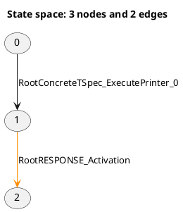

# LTSVisualizer

An interactive web application for exploring large labelled transition systems and reachability graphs described in PlantUML format.


LTSVisualizer was created primarily for reachability graphs generated from Colored Petri Nets, where:

- **Nodes** represent markings or states.
- **Edges** represent fired transitions.
- **Transition input comments** describe the data consumed by a transition.
- **Marking comments** describe the distribution of tokens across Petri-net places.

The application combines a Python/FastAPI parser with a React and Cytoscape.js frontend. It supports both small linear graphs and large cyclic state spaces containing thousands of nodes and transitions.

## Features

- Open `.puml`, `.plantuml`, and PlantUML `.txt` files from the browser.
- Parse directed states and transitions from PlantUML graph syntax.
- Preserve transition colors such as `#darkorange`.
- Parse structured transition-input data.
- Parse structured state markings and token values.
- Explore one-, two-, or three-hop neighborhoods around a selected state.
- Search directly for a state by ID.
- Switch between hierarchical and grid layouts.
- Show or hide transition labels.
- Pan, zoom, select, and manually reposition states.
- Inspect state markings by hovering over or selecting nodes.
- Inspect consumed transition-input data by hovering over or selecting edges.
- Pin inspector content while continuing to explore the graph.
- Use a lightweight full-graph overview for very large state spaces.

## Example input

LTSVisualizer accepts graph edges in the following form:



The comments are optional. A file containing only nodes, edges, and transition labels can still be visualized.

## Technology stack

### Backend

- Python 3.11 or newer
- FastAPI
- Uvicorn
- Pydantic
- python-multipart

### Frontend

- React
- TypeScript
- Vite
- Cytoscape.js
- Axios

## Project structure

```text
LTSVisualizer/
├── backend/
│   ├── app/
│   │   ├── models/
│   │   │   └── graph_model.py
│   │   ├── parser/
│   │   │   ├── puml_parser.py
│   │   │   └── token_parser.py
│   │   └── main.py
│   ├── tests/
│   ├── requirements.txt
│   └── requirements-dev.txt
├── frontend/
│   ├── public/
│   ├── src/
│   │   ├── App.css
│   │   ├── App.tsx
│   │   ├── index.css
│   │   └── main.tsx
│   ├── package.json
│   └── vite.config.ts
├── sample-data/
├── .gitignore
├── LICENSE
└── README.md
```

## Prerequisites

Install the following software before running the project locally:

- Python 3.11 or newer
- Node.js 22 LTS or newer
- npm
- Git

## Local development

### 1. Clone the repository

```bash
git clone https://github.com/dbera/LTSVisualizer.git
cd LTSVisualizer
```

### 2. Set up the backend

On Windows PowerShell:

```powershell
python -m venv .venv
.\.venv\Scripts\Activate.ps1
python -m pip install --upgrade pip
python -m pip install -r backend\requirements-dev.txt
```

On Linux or macOS:

```bash
python3 -m venv .venv
source .venv/bin/activate
python -m pip install --upgrade pip
python -m pip install -r backend/requirements-dev.txt
```

Start the backend from the `backend` directory:

```bash
cd backend
uvicorn app.main:app --reload --port 8000
```

The API is then available at:

```text
http://127.0.0.1:8000
```

Interactive API documentation is available at:

```text
http://127.0.0.1:8000/docs
```

### 3. Set up the frontend

Open a second terminal at the repository root:

```bash
cd frontend
npm install
npm run dev
```

Open the URL displayed by Vite, normally:

```text
http://localhost:5173
```

## Using the dashboard

1. Start both the FastAPI backend and Vite frontend.
2. Open the dashboard in a browser.
3. Select **Open PlantUML file**.
4. Choose a `.puml`, `.plantuml`, or compatible `.txt` file.
5. Enter a state ID to focus on a particular state.
6. Use **1 hop**, **2 hops**, or **3 hops** to control neighborhood depth.
7. Use **Show all** to display the complete state space.
8. Switch between **Hierarchical** and **Grid** layouts as needed.
9. Toggle transition labels for readability and performance.
10. Hover over or select graph elements to inspect semantic data.

For very large graphs, neighborhood exploration is recommended instead of displaying every node and transition simultaneously.

## API endpoints

### Health/status endpoint

```http
GET /
```

### Parse the bundled development example

```http
GET /graph
```

### Upload and parse a PlantUML graph

```http
POST /graph/upload
```

The upload endpoint accepts multipart form data with a field named `file`.

## Development checks

Run backend tests from the repository root:

```bash
python -m pytest backend/tests
```

Run the frontend checks:

```bash
cd frontend
npm run lint
npm run build
```

## Current limitations

- The parser targets the reachability-graph PlantUML convention described above rather than every PlantUML diagram type.
- Extremely large full-graph views can be visually dense even when rendering remains responsive.
- Global force-directed layouts are intentionally avoided for very large state spaces because they can be computationally expensive in the browser.
- Uploaded files are parsed in memory and are not intended to be permanently stored by the backend.

## Roadmap

Potential future improvements include:

- Shortest-path search between states.
- Deadlock-state detection.
- Strongly connected component analysis.
- State-to-state marking differences.
- Token-journey visualization.
- Transition-frequency analytics.
- Export of selected paths and filtered subgraphs.
- Packaged Windows desktop distribution.

## Contributing

Contributions, bug reports, and feature suggestions are welcome. See [`CONTRIBUTING.md`](CONTRIBUTING.md) for development and pull-request guidelines.

## Security

Please do not disclose security vulnerabilities through public GitHub issues. See [`SECURITY.md`](SECURITY.md) for the reporting process.

## License

This project is licensed under the MIT License. See [`LICENSE`](LICENSE) for details.

## Author

Debjyoti Bera

Project repository: <https://github.com/dbera/LTSVisualizer>
